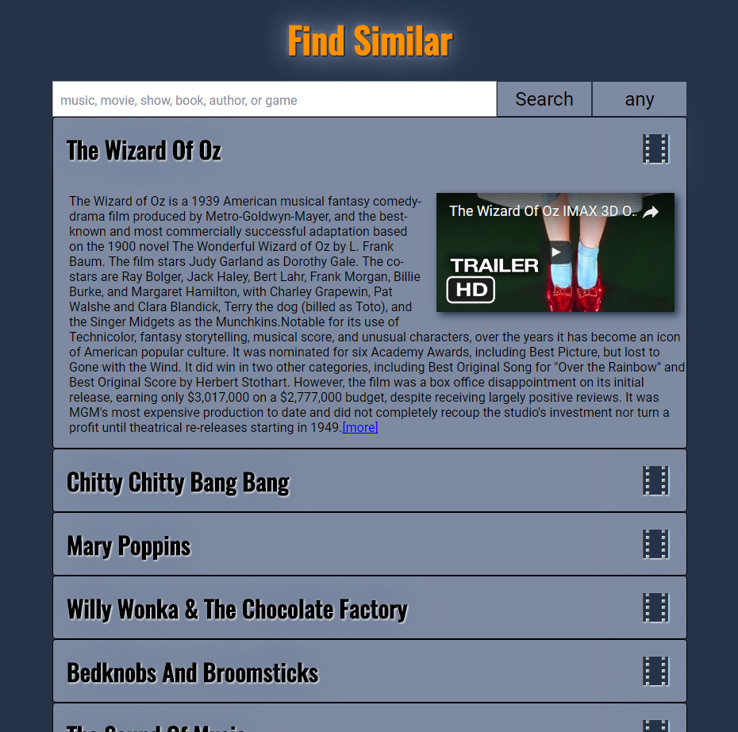

#Find Similar
Thinkful - Capstone Project -  a responsive app that integrates with a third party API to return suggestion based on users entertainment tastes.

##Summary
Find Similar gives recommendations and helps you discover new music, movies, TV shows, books, authors and games, based on what you like. Just input a favorite of yours and the app will give a list of similar items. This list can be expanded to show a synopsis and video.  The output can also be easily filtered by type (music, movies, etc.)

##Technical
* The app is built using HTML, CSS, JavaScript, and jQuery
* The app is fully responsive, adapting for mobile, table and desktop viewports.
